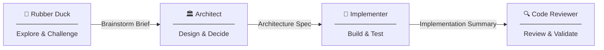

# Spring Crew

[](LICENSE)
[](https://github.com/marcelorodrigo/spring-crew-plugin/tags)

A four-agent AI development pipeline for Spring Boot — powered by GitHub Copilot and [opencode](https://github.com/sst/opencode).

---

## What Is This?

Spring Crew is a plugin that installs four specialized AI agents for Spring Boot development. Available for **GitHub Copilot** (CLI and VS Code) and **opencode**. Once installed, the agents are available in every project you open — no per-repo setup, no file copying.

The four agents form a **sequential development pipeline**: each one picks up where the previous left off, producing a structured output that feeds into the next. The pipeline takes you from a vague idea all the way to reviewed, production-ready code.

The agents are purpose-built for **Spring Boot development with Clean Architecture** — the UseCase pattern, gateway abstractions, domain exceptions, constructor injection, and proper layering are baked into every agent's thinking.

---

## The Agents

| Agent | Role | Produces |
|-------|------|----------|
| **Rubber Duck** | Brainstorming sparring partner | Brainstorm Brief |
| **Architect** | Architecture formalizer | Architecture Spec |
| **Implementer** | Production code builder | Working, tested code |
| **Code Reviewer** | Code review validator | Code Review report |

### Rubber Duck
A senior technical peer, not an assistant. Challenges assumptions, widens the solution space, and stress-tests ideas before you commit to a design. Invoke it when you have a vague idea or want to think through trade-offs. It produces a **Brainstorm Brief** for the Architect.

### Architect
A senior software architect specializing in Clean Architecture and Spring Boot. Takes the Brainstorm Brief and produces a precise, buildable **Architecture Spec** — exact class names, package structure, API contracts, error handling strategy, and test plan. No hand-waving.

### Implementer
A senior Spring Boot developer. Takes the Architecture Spec and writes production-ready code — domain models, gateways, use cases, controllers, and tests — following the conventions already in your codebase. Produces an **Implementation Summary** for the Code Reviewer.

### Code Reviewer
A meticulous senior code reviewer. Validates the implementation against the Architecture Spec, Clean Architecture principles, and Spring Boot best practices. Read-only — it reviews, it never modifies. Produces a categorized **Code Review** (🔴 Critical / 🟡 Important / 🟢 Suggestion).

---

## The Pipeline



Each agent's output is the next agent's input. You can enter the pipeline at any stage — invoke the Architect directly if you already know the direction, or the Implementer if you already have a spec.

---

## Installation — Copilot CLI

**Step 1** — Register the Spring Crew marketplace:

```bash
copilot plugin marketplace add marcelorodrigo/spring-crew-plugin
```

**Step 2** — Install the plugin from the marketplace:

```bash
copilot plugin install spring-crew@spring-crew-plugin
```

Verify the install:

```bash
copilot plugin list
```

You should see `spring-crew` in the list.

### Usage

```bash
# Start with brainstorming
copilot @rubber-duck "I want to add a distributed caching layer to my order service"

# Formalize the design
copilot @architect "Here is the brainstorm brief: ..."

# Build it
copilot @implementer "Here is the architecture spec: ..."

# Review it
copilot @code-reviewer "Review the changes on this branch against the spec"
```

---

## Installation — VS Code

> **Note:** Agent plugins are a preview feature in VS Code. Enable the preview first.

**Step 1** — Enable agent plugins in VS Code settings (`settings.json`):

```json
{
  "chat.plugins.enabled": true
}
```

**Step 2** — Add the Spring Crew marketplace:

```json
{
  "chat.plugins.marketplaces": [
    "marcelorodrigo/spring-crew-plugin"
  ]
}
```

**Step 3** — Open the Extensions view (`Cmd+Shift+X` / `Ctrl+Shift+X`) and search for `@agentPlugins`. Find **Spring Crew** and click **Install**.

**Step 4** — Open Copilot Chat and invoke any agent:

```
@rubber-duck I want to redesign how we handle order fulfilment
@architect Here is the brainstorm brief: ...
@implementer Here is the architecture spec: ...
@code-reviewer Review the implementation against the spec
```

---

## Installation — OpenCode

Add to your `opencode.json`:

```json
{
  "plugin": {
    "spring-crew-plugin": true
  }
}
```

The plugin provides four agents, invoked via `@mention`:

| Agent | Usage |
|-------|-------|
| `@spring-crew:rubber-duck` | Brainstorming sparring partner |
| `@spring-crew:architect` | Architecture formalizer |
| `@spring-crew:implementer` | Implementation builder |
| `@spring-crew:code-reviewer` | Code reviewer (read-only) |

```text
@spring-crew:rubber-duck I want to add a distributed caching layer to my order service
@spring-crew:architect Here is the brainstorm brief: ...
@spring-crew:implementer Here is the architecture spec: ...
@spring-crew:code-reviewer Review the changes on this branch against the spec
```

You can override any agent's model or settings in your `opencode.json`:

```json
{
  "agent": {
    "spring-crew:architect": {
      "model": "anthropic/claude-sonnet-4-20250514"
    }
  }
}
```

---

## Updating

```bash
# Copilot CLI
copilot plugin update spring-crew
```

In VS Code: Extensions view → Agent Plugins → **Update**.

---

## Uninstalling

```bash
# Copilot CLI
copilot plugin uninstall spring-crew
```

---

## Requirements

- A GitHub Copilot subscription (Individual, Business, or Enterprise), **or**
- [opencode](https://github.com/sst/opencode) installed
- **Copilot CLI** — for terminal-based usage, or
- **VS Code** with `chat.plugins.enabled: true` (preview feature), or
- **opencode** — terminal-based AI coding assistant

---

## License

MIT — see [LICENSE](LICENSE).

---

## Releasing

### Copilot CLI

1. Update `version` in `.github/plugin/plugin.json`
2. Update `plugins[0].version` in `.github/plugin/marketplace.json`

### OpenCode / npm

3. Update `version` in `package.json` to match

### All

4. Commit: `git commit -m "chore: release vX.Y.Z"`
5. Tag: `git tag vX.Y.Z && git push origin vX.Y.Z`

The Copilot CLI CI enforces that `plugin.json` and `marketplace.json` carry the same version. Mismatches will fail the workflow.

Pushing a `v*` tag also triggers the `build-opencode.yml` workflow to publish the npm package automatically. Requires `NPM_TOKEN` secret configured in repository settings.

> **Note:** `metadata.version` in `marketplace.json` tracks the marketplace registry itself, not the plugin. Only bump it when the marketplace structure changes, not on every plugin release.
